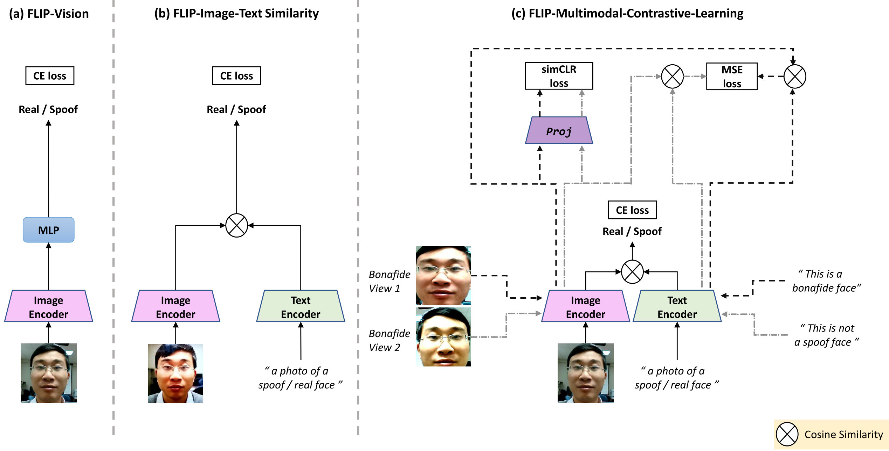

<p align="center">

  <h2 align="center"><strong>FLIP: Cross-domain Face Anti-spoofing with Language Guidance</strong></h2>
  <h3 align="center"><strong>[ICCV 2023]</strong></h3>

  <p align="center">
    <a href="https://koushiksrivats.github.io"><strong> Koushik Srivatsan</strong></a>,
    <a href="https://muzammal-naseer.netlify.app"><strong> Muzammal Naseer</strong></a>,
    <a href="https://scholar.google.com/citations?user=2qx0RnEAAAAJ&hl=en"><strong> Karthik Nandakumar</strong></a>
    <br>
    <span style="font-size:1em; "><strong> MBZUAI, UAE</strong>.</span>
  </p>
</p>


<p align="center">
  <a href="https://openaccess.thecvf.com/content/ICCV2023/papers/Srivatsan_FLIP_Cross-domain_Face_Anti-spoofing_with_Language_Guidance_ICCV_2023_paper.pdf" target='_blank'>
    
  </a> 
  
  <a href="https://koushiksrivats.github.io/FLIP/" target='_blank'>
    
  </a>

  <!-- <a href="" target='_blank'>
    
  </a> -->
</p>


##  Updates :loudspeaker:
  - **28-09-2023**: Code released.


## Highlights :star2:
<p align="center">
  

  <ol>
  <li>We show that direct finetuning of a multimodal pre-trained ViT (e.g., CLIP image encoder) achieves better FAS generalizability without any bells and whistles.</li>
  <li>We propose a new approach for robust cross-domain FAS by grounding the visual representation using natural language semantics. This is realized by aligning the image representation with an ensemble of text prompts (describing the class) during finetuning.</li>
  <li>We propose a multimodal contrastive learning strategy, which enforces the model to learn more generalized features that bridge the FAS domain gap even with limited training data. This strategy leverages view-based image self-supervision and view-based cross-modal image-text similarity as additional constraints during the learning process.</li>
  <li>Extensive experiments on three standard protocols demonstrate that our method significantly outperforms the state- of-the-art methods, achieving better zero-shot transfer performance than five-shot transfer of “adaptive ViTs”.</li>
</ol>
</p>


## Instruction for code usage :page_facing_up:

### Setup
- Get Code
```shell
 git clone https://github.com/koushiksrivats/FLIP.git
```
- Build Environment
```shell
cd FLIP
conda env create -f environment.yml
conda activate fas
```

### Dataset Pre-Processing
Please refer to [datasets.md](docs/datasets.md) for acquiring and pre-processing the datasets.

### Training and Inference
Please refer to [run.md](docs/run.md) for training and evaluating the models.


## Citation
If you're using this work in your research or applications, please cite using this BibTeX:
```bibtex
  @InProceedings{Srivatsan_2023_ICCV,
    author    = {Srivatsan, Koushik and Naseer, Muzammal and Nandakumar, Karthik},
    title     = {FLIP: Cross-domain Face Anti-spoofing with Language Guidance},
    booktitle = {Proceedings of the IEEE/CVF International Conference on Computer Vision (ICCV)},
    month     = {October},
    year      = {2023},
    pages     = {19685-19696}
}
```


## Acknowledgement :pray:
Our code is built on top of the [few_shot_fas](https://github.com/hhsinping/few_shot_fas) repository. We thank the authors for releasing their code.