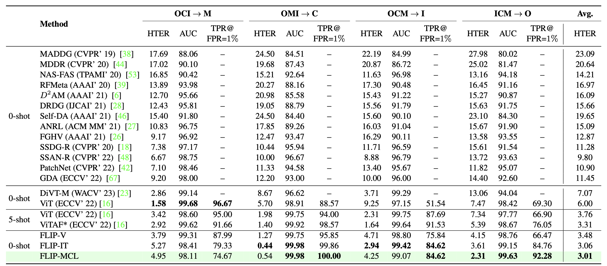
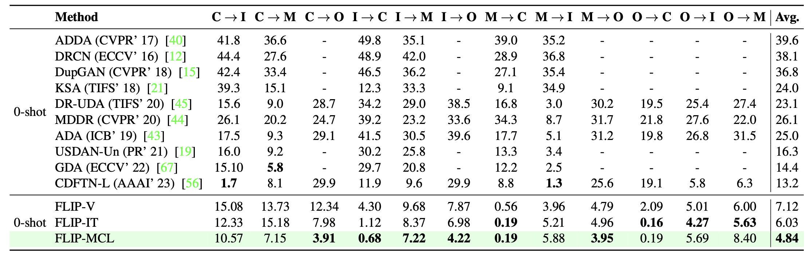
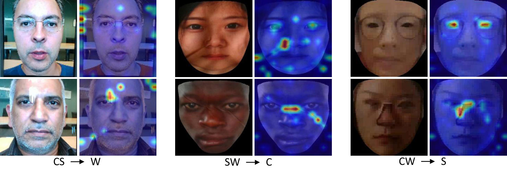

<p align="center">

  <h2 align="center"><strong>FLIP: Cross-domain Face Anti-spoofing with Language Guidance</strong></h2>
  <h3 align="center"><strong>[ICCV 2023]</strong></h3>

  <p align="center">
    <a href="https://koushiksrivats.github.io"><strong> Koushik Srivatsan</strong></a>,
    <a href="https://muzammal-naseer.netlify.app"><strong> Muzammal Naseer</strong></a>,
    <a href="https://scholar.google.com/citations?user=2qx0RnEAAAAJ&hl=en"><strong> Karthik Nandakumar</strong></a>
    <br>
    <span style="font-size:1em; "><strong> MBZUAI, UAE</strong>.</span>
  </p>
</p>


<p align="center">
  <a href="https://openaccess.thecvf.com/content/ICCV2023/papers/Srivatsan_FLIP_Cross-domain_Face_Anti-spoofing_with_Language_Guidance_ICCV_2023_paper.pdf" target='_blank'>
    
  </a> 

  <a href="https://arxiv.org/pdf/2309.16649.pdf" target='_blank'>
    
  </a>
  
  <a href="https://koushiksrivats.github.io/FLIP/" target='_blank'>
    
  </a>

  <!-- <a href="" target='_blank'>
    
  </a> -->
</p>


##  Updates :loudspeaker:
  - **28-09-2023**: Code released.


## Highlights :star2:
<p align="center">
  

  <ol>
  <li>We show that direct finetuning of a multimodal pre-trained ViT (e.g., CLIP image encoder) achieves better FAS generalizability without any bells and whistles.</li>
  <li>We propose a new approach for robust cross-domain FAS by grounding the visual representation using natural language semantics. This is realized by aligning the image representation with an ensemble of text prompts (describing the class) during finetuning.</li>
  <li>We propose a multimodal contrastive learning strategy, which enforces the model to learn more generalized features that bridge the FAS domain gap even with limited training data. This strategy leverages view-based image self-supervision and view-based cross-modal image-text similarity as additional constraints during the learning process.</li>
  <li>Extensive experiments on three standard protocols demonstrate that our method significantly outperforms the state- of-the-art methods, achieving better zero-shot transfer performance than five-shot transfer of “adaptive ViTs”.</li>
</ol>
</p>


## Instruction for code usage :page_facing_up:

### Setup
- Get Code
```shell
 git clone https://github.com/koushiksrivats/FLIP.git
```
- Build Environment
```shell
cd FLIP
conda env create -f environment.yml
conda activate fas
```

### Dataset Pre-Processing
Please refer to [datasets.md](docs/datasets.md) for acquiring and pre-processing the datasets.

### Training and Inference
Please refer to [run.md](docs/run.md) for training and evaluating the models.


### Model Zoo
MCIO Benchmark
| Leave-out | Checkpoint ||
|-----------|--------|--------|
| MSU |   [0-shot](https://mbzuaiac-my.sharepoint.com/:u:/g/personal/koushik_srivatsan_mbzuai_ac_ae/ESNSHzcm2phJsgWTZvLL70sBoT9MfBwEaLI1X4LYrY5wOA?e=L0wqU6) |  [5-shot](https://mbzuaiac-my.sharepoint.com/:u:/g/personal/koushik_srivatsan_mbzuai_ac_ae/EYMmatP1ZAJJoiXxOtCmdyUB1XDu1u4mgV42L3nLNR9tcg?e=8YOYpt)  |
| CASIA |   [0-shot](https://mbzuaiac-my.sharepoint.com/:u:/g/personal/koushik_srivatsan_mbzuai_ac_ae/Ee7IMGhHuVtErk46zUu6DOIBkLNAtAH1ZLsyyvCpvWXddw?e=vkdbLo) |  [5-shot](https://mbzuaiac-my.sharepoint.com/:u:/g/personal/koushik_srivatsan_mbzuai_ac_ae/Ecc8_z2yO1pLmc5Z1sl5Z0QB8N6nqyenyNREXZb8TsvVcQ?e=VfPsfw)  |
| IDIAP |   [0-shot](https://mbzuaiac-my.sharepoint.com/:u:/g/personal/koushik_srivatsan_mbzuai_ac_ae/ES-SjpUsqBZPnCHGjQr5RywBz_srU4gy__jccjMcK3ySPg?e=0Cfr7i) |  [5-shot](https://mbzuaiac-my.sharepoint.com/:u:/g/personal/koushik_srivatsan_mbzuai_ac_ae/EcjVdoS3pHxPpQJ4baL6PcsBXddw6ozGU9zmEjUz7AXlRw?e=5FgqKC)  |
| OULU |   [0-shot](https://mbzuaiac-my.sharepoint.com/:u:/g/personal/koushik_srivatsan_mbzuai_ac_ae/EXq096bu3GlMrRKJGfHuXwQBxVlV5arKlDswxRVqn6DATg?e=tr8Q04) |  [5-shot](https://mbzuaiac-my.sharepoint.com/:u:/g/personal/koushik_srivatsan_mbzuai_ac_ae/EcjV-HNml-5IlyMJ2pkZ-pgBYJInVQeJnam3DWGK7n2AxA?e=oPi0mv)  |

----------------------------------------------------------------------------------------------------------------------------

WCS Benchmark
| Leave-out | Checkpoint ||
|-----------|--------|--------|
| WMCA | [0-shot](https://mbzuaiac-my.sharepoint.com/:u:/g/personal/koushik_srivatsan_mbzuai_ac_ae/Eci8NGbRghRFhe8XbKT5zM4BaemZL14Rv9OUo812KI05gw?e=HkTpMm) | [5-shot](https://mbzuaiac-my.sharepoint.com/:u:/g/personal/koushik_srivatsan_mbzuai_ac_ae/EbVOHUOYM71OvSoknWfV7H0BFEOAoE3f5lOOSlXsGggrwA?e=YsZQAZ) |
| CeFA | [0-shot](https://mbzuaiac-my.sharepoint.com/:u:/g/personal/koushik_srivatsan_mbzuai_ac_ae/EVYJub_HzZ5NjLaLQ_WwrfEBQcuY9yCs12knWWRxbcJToQ?e=A9wWGH) | [5-shot](https://mbzuaiac-my.sharepoint.com/:u:/g/personal/koushik_srivatsan_mbzuai_ac_ae/EdpzlWgwXXZPl5WNnv0NQvwBgtmNmS6CsNV5QZQawMtsZA?e=9VNnUC) |
| SURF | [0-shot](https://mbzuaiac-my.sharepoint.com/:u:/g/personal/koushik_srivatsan_mbzuai_ac_ae/EdbVYxkP21pPmIhdkl6n7joBEZyKennbpsoBloZma4FYnw?e=OJFqfQ) | [5-shot](https://mbzuaiac-my.sharepoint.com/:u:/g/personal/koushik_srivatsan_mbzuai_ac_ae/Eau3_ZXO5OVDgr519SHevoMBhR12iIovz2xv7NxN3uHGiw?e=eRFs56) |


## Results :chart_with_upwards_trend:
<p align="center">
  Cross Domain performance in Protocol 1
  
</p>

<p align="center">
  Cross Domain performance in Protocol 2
  
</p>

<p align="center">
  Cross Domain performance in Protocol 3
  
</p>


## Visualizations :art:
<p align="center">
  <strong>Attention Maps on the spoof samples in MCIO datasets:</strong>
  Attention highlights are on the spoof-specific clues such as paper texture (M), edges of the paper (C), and moire patterns (I and O).
  
</p>

<p align="center">
  <strong>Attention Maps on the spoof samples in WCS datasets:</strong>
  Attention highlights are on the spoof-specific clues such as screen edges/screen reflection (W), wrinkles in printed cloth (C), and cut-out eyes/nose (S).
  
</p>


## Citation
If you're using this work in your research or applications, please cite using this BibTeX:
```bibtex
  @InProceedings{Srivatsan_2023_ICCV,
    author    = {Srivatsan, Koushik and Naseer, Muzammal and Nandakumar, Karthik},
    title     = {FLIP: Cross-domain Face Anti-spoofing with Language Guidance},
    booktitle = {Proceedings of the IEEE/CVF International Conference on Computer Vision (ICCV)},
    month     = {October},
    year      = {2023},
    pages     = {19685-19696}
}
```


## Acknowledgement :pray:
Our code is built on top of the [few_shot_fas](https://github.com/hhsinping/few_shot_fas) repository. We thank the authors for releasing their code.